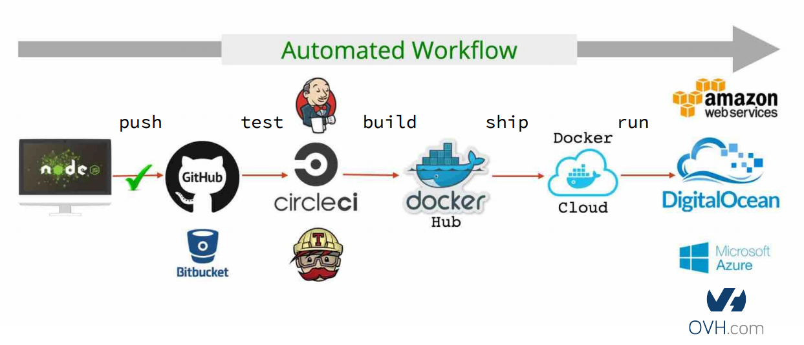
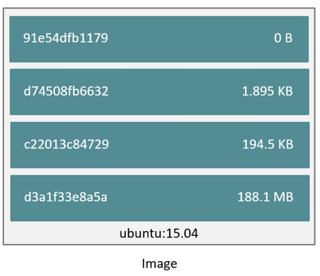

# Rapid Team Formation Method - Docker

(The main part of the documentation comes from https://www.docker.com/)


---

## Why containers ?

- Isolate a process and its dependencies in an independant item : a container.
- Manage and put some limits to the available resources (CPU, RAM, IO)

---

## Why Docker ?


---

## Why Docker ?


---

## Why Docker ?


---

## What is Docker ?

> Docker is an open-source project that automates the deployment of applications inside software containers.

---

## What is Docker ?

> Docker is an open platform for developers and sysadmins to build, ship, and run distributed applications.


---

## What is Docker ?

> Docker containers wrap a piece of software in a complete filesystem that contains everything needed to run:
    code, runtime, system tools, system libraries – anything that can be installed on a server.
    This guarantees that the software will always run the same, regardless of its environment.


---

## What is a container ?


---

### Lightweight

> Containers running on a single machine share the same operating system kernel;
    they start instantly and use less RAM. Images are constructed from layered filesystems and share common files,
    making disk usage and image downloads much more efficient.

---

### Open

> Docker containers are based on open standards, enabling containers to run on all major Linux distributions
    and on Microsoft Windows -- and on top of any infrastructure.

---

### Secure by default

> Containers isolate applications from one another and the underlying infrastructure,
  while providing an added layer of protection for the application.

---

### Containers VS VM


---

#### Virtual machines

> Virtual machines include the application, the necessary binaries and libraries,
    and an entire guest operating system -- all of which can amount to tens of GBs.


---

#### Containers

> Containers include the application and all of its dependencies --but share the kernel with other containers,
    running as isolated processes in user space on the host operating system.
    Docker containers are not tied to any specific infrastructure: they run on any computer,
    on any infrastructure, and in any cloud.


---

#### Containers

> «Saying a container is a light VM is like saying a folder is a light partition»


---

#### Isolation

- Control and limit of the resources consumption (CPU, RAM, I/O)
- Network isolation
- Filesystem isolation
- Users & groups isolation
- processes isolation

---

### Docker accesses virtualisation features of Linux


---

### Native Docker support on Windows


---

### Docker for DevOps


---

### Docker for DevOps



---

### Essential Docker components


---

## Usage

---

### Can I install Docker from commandline?

Yes! from get.docker.com

```
curl -sSL https://get.docker.com/ | sh
wget -qO- https://get.docker.com/ | sh
```

---

### Hello World


---

### Using images

> An image is a filesystem and parameters to use at runtime. It doesn’t have state and never changes.

To get an image, two choices :

- Pull it from the global https://hub.docker.com/ registry :

`docker pull myimage`

- Create and build it on your host with a `Dockerfile` file :

`docker build -f ./myDockerfile -t myImageName`

---

### Building image

```
FROM gcc:latest

COPY . /usr/src/myapp
WORKDIR /usr/src/myapp

RUN gcc -o hello hello.c

CMD ["./hello"]
```
---

### Building image

```
> docker build . -t "myapp:latest"

Sending build context to Docker daemon 3.072 kB
Step 1 : FROM gcc:latest
 ---> a0b516dc1799
// .. steps removed ...
Step 6 : CMD ./hello
 ---> Using cache
 ---> f99e7f18fa42
Successfully built f99e7f18fa42
```

---

### Using containers

> A container is a running instance of an image.

To run a new container from an image :

```bash
docker run --myOptions myImage myCommand
```
Example :

```bash
docker run --rm myapp:latest
```

```bash
docker run --rm node npm version
```

```bash
docker run --rm -ti -u node -w /usr/src/app node:7.2 bash
```

```bash
docker run --rm -ti -u node -w /usr/src/app -p 3001:3000 node:7.2 node server.js
```

---

## «Build. Ship. Run. Any app. Anywhere.»

---

### Build.

A built image contains all the application and its dependencies. An image is immutable.

Once the image built, it **cannot** be updated.

---

### Ship.

The image is stored in a public or private registry.

---

### Run.

A container can be created from an image at any time.

---

### Any app.

- Compiled Go binary
- MySQL server
- bash
- c++
- PHP
- desktop application
- ...

---

### Anywhere.

Docker is available on :

- Linux x64/ARM
- Windows
- MacOS

...

- Serveur dédié
- VM
- RaspberryPi
- ...

---

## Images, containers, and storage drivers


---

### Image

- A docker image is a stack of read-only layers in an union filesystem
- Each layer contains a modification set relative to the previous layer
- An image is read-only
- An image is stateless
- An image is used to create a container
- An image can be the parent of another image

---

#### Image


---

#### Dockerfile

```
FROM alpine:3.7

RUN apk add --update --no-cache ca-certificates \
  && apk add --no-cache \
    php7-fpm \
    php7-apcu \
    curl \
 && rm -rf /var/cache/apk/* && rm -rf /tmp/*

RUN addgroup www-data && adduser -h /var/www -D -g '' -G www-data www-data

COPY ./bin/entrypoint /usr/bin/entrypoint
COPY . /srv/

ENV APP_ENV prod

ENTRYPOINT ["entrypoint"]
CMD ["php-fpm7", "-F"]

WORKDIR /srv
EXPOSE 9001

```

---

#### Image layers

> Each Docker image references a list of read-only layers that represent filesystem differences. 



> The Docker storage driver is responsible for stacking these layers and providing a single unified view.

---

#### Image layers - Download

```
$ docker pull ubuntu:15.04
15.04: Pulling from library/ubuntu
47984b517ca9: Pull complete
df6e891a3ea9: Pull complete
e65155041eed: Pull complete
c8be1ac8145a: Pull complete
Digest: sha256:5e279a9df07990286cce22e1b0f5b0490629ca6d187698746ae5e28e604a640e
Status: Downloaded newer image for ubuntu:15.04
```

---

#### Dockerfile and layers

- Each line of the Dockerfile will be a new layer
- Layers are cached
- Each layer can be a tagged image

---

#### An image's layers

```
$ docker history nginx
IMAGE CREATED CREATED BY SIZE
ba6bed934df2 3 weeks ago /bin/sh -c #(nop) CMD ["nginx" "-g" "daemon 0 B
<missing> 3 weeks ago /bin/sh -c #(nop) EXPOSE 443/tcp 80/tcp 0 B
<missing> 3 weeks ago /bin/sh -c ln -sf /dev/stdout /var/log/nginx/ 22B
<missing> 3 weeks ago /bin/sh -c apt-key adv --keyserver hkp://pgp. 58.38 MB
<missing> 3 weeks ago /bin/sh -c #(nop) ENV NGINX_VERSION=1.11.4-1 0 B
<missing> 3 weeks ago /bin/sh -c #(nop) MAINTAINER NGINX Docker Ma 0 B
<missing> 3 weeks ago /bin/sh -c #(nop) CMD ["/bin/bash"] 0 B
<missing> 3 weeks ago /bin/sh -c #(nop) ADD file:c6c23585ab140b0b32 123 MB 
```

---

### Container

- It's the creation of a temporary writable layer on the top of an image
- The writable layer contains all the user's modifications
- The container is created with the run command

---

#### Container


---

#### Container


docker build # => image
docker push
docker pull
docker run <image-name> # => container


---

#### Container !== VM

```
$ time docker run alpine echo "Running in a container!"

Unable to find image 'alpine:latest' locally
latest: Pulling from library/alpine
c0cb142e4345: Pull complete
Digest: sha256:ca7b185775966003d38ccbd9bba822fb570766e4bb69292ac23490f36f8a742e
Status: Downloaded newer image for alpine:latest
Running in a container!
real 0m2.874s
user 0m0.000s
sys 0m0.040s

$ time docker run alpine echo "Running in a container!"
Running in a container!
real 0m0.241s
user 0m0.000s
sys 0m0.024s
```

---

#### Container layer

> When you create a new container, you add a new, thin, writable layer on top of the underlying stack.
    This layer is often called the “container layer”.
    All changes made to the running container - such as writing new files,
    modifying existing files, and deleting files - are written to this thin writable container layer. 


> Docker 1.10 introduced a new content addressable storage model.
    Previously, image and layer data was referenced and stored using a randomly generated UUID.
    In the new model this is replaced by a secure content hash.

---

#### Storage drivers

> The Docker storage driver is responsible for enabling and managing both the image layers and the writable container layer.
    How a storage driver accomplishes these can vary between drivers. Two key technologies behind Docker image and container
    management are stackable image layers and copy-on-write (CoW).


---

##### The copy-on-write strategy

> In this strategy, system processes that need the same data share the same instance of that data rather than having their own copy.
    At some point, if one process needs to modify or write to the data, only then does the operating system make a copy of the data
    for that process to use. Only the process that needs to write has access to the data copy. All the other processes continue to
    use the original data.

- Search through the image layers for the file to update.
    The process starts at the top, newest layer and works down to the base layer one layer at a time.
- Perform a “copy-up” operation on the first copy of the file that is found.
    A “copy up” copies the file up to the container’s own thin writable layer.
- Modify the copy of the file in container’s thin writable layer.

---

##### AUFS

> AUFS was the first storage driver in use with Docker.
    AUFS is a unification filesystem. This means that it takes multiple directories on a single Linux host,
    stacks them on top of each other, and provides a single unified view. To achieve this, AUFS uses a union mount.


---

##### AUFS - Details

> AUFS also supports the copy-on-write technology.

- When a container do a write operation on a file, the file is fully copied in the container layer
- When a file is deleted, a `without file` is created in the container layer
- Renaming directories is not fully supported => the app should handle EXDEV (“cross-device link not permitted”)
    and fall back to a “copy and unlink” strategy.
- Storage path : `/var/lib/docker/aufs/diff/` for images and containers layers, `/var/lib/docker/aufs/layers/` for layers metadata,
    `/var/lib/docker/aufs/mnt/<container-id>` for union mount point, and `/var/lib/docker/containers/<container-id>` for containers
    metadata and config files

---

##### Other storage drivers

- Device mapper
- Btrfs
- Zfs
- ...

> // TODO with love :)

---

### Volumes

> When a container is deleted, any data written to the container that is not stored in a data volume is deleted along with the container.

> A data volume is a directory or file in the Docker host’s filesystem that is mounted directly into a container.

> Reads and writes to data volumes bypass the storage driver and operate at native host speeds. You can mount any number of data volumes into a container.

> Multiple containers can also share one or more data volumes.

---

### Network

See the demo ;-)
