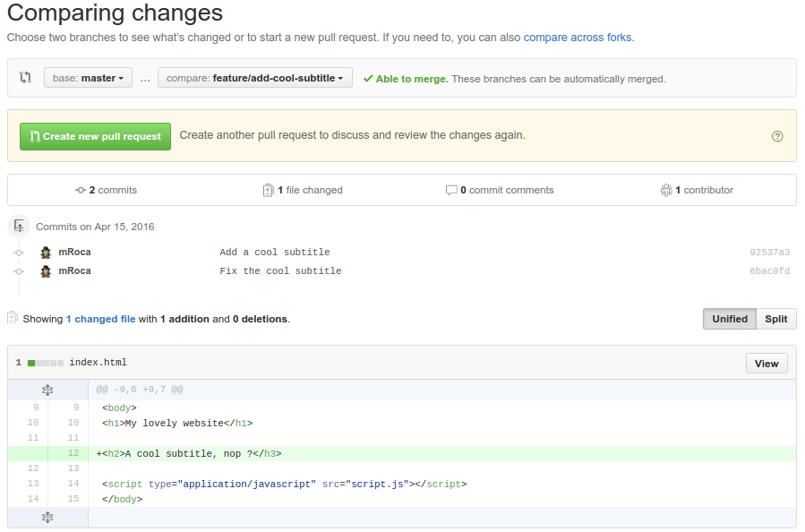
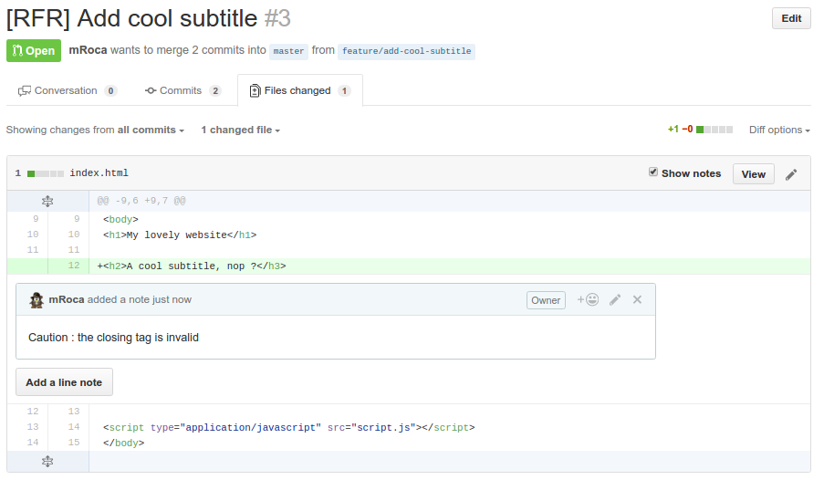
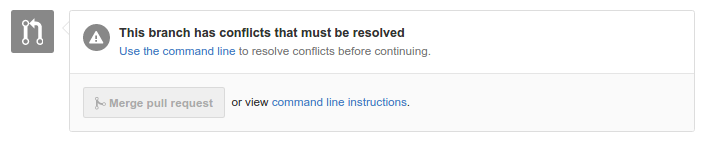
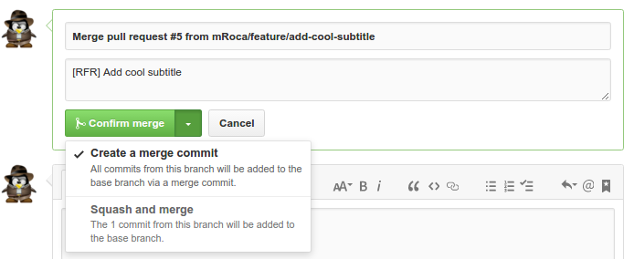

# Rapid Team Formation Method - Git

---

## Once upon a time ... a web project

```
.
├── index.html
├── script.js
└── style.css

0 directories, 3 files
```

And its git commits

```
* faace49 - Add comment line 4  (HEAD, origin/master, master)
* d968810 - Add comment line 3 
* dfd7dcd - Add comment line 2 
* a671eb0 - Add comment line 1 
* 4b19495 - Add index page 
```

---

## What is the commit hash ?

```bash
git cat-file commit faace497d0644e1c0f5f08e7f9753b19f4227172
```

```
tree 5e1bb24d501fc601cf429c9d963d0cdcf709521a
parent d968810e0e2b3e1a77af1ffb53bcaf14457bdc64
author mRoca <mroca.dh@gmail.com> 1460712656 +0200
committer mRoca <mroca.dh@gmail.com> 1460712656 +0200

Add comment line 4
```

The commit hash function :

```
sha1(
    commit message  => "Add comment line 4"
    commiter        => Michel Roca <mroca.dh@gmail.com>
    commit date     => Fri Apr 15 11:30:56 2016 +0200
    author          => Michel Roca <mroca.dh@gmail.com>
    author date     => Fri Apr 15 11:30:56 2016 +0200
    tree            => 5e1bb24d501fc601cf429c9d963d0cdcf709521a
    parents         => [d968810e0e2b3e1a77af1ffb53bcaf14457bdc64]
)
```

---

## A new feature must be developed

**Create a new branch**

```bash
git checkout -b feature/add-cool-subtitle master
```

**Code**

*I hope you know what to do here ;-)*

**Commit**

```bash
git commit -am "Add a cool subtitle"
```

```
* 92537a3 - Add a cool subtitle  (HEAD, feature/add-cool-subtitle)
* faace49 - Add comment line 4  (origin/master, master)
* d968810 - Add comment line 3 
* dfd7dcd - Add comment line 2 
* a671eb0 - Add comment line 1 
* 4b19495 - Add index page 
```

---

## ... And we add more and more code

**Fix things, add things, code things**

*I hope you know what to do here ;-)*

**Commit**

```bash
git commit -am "Fix the cool subtitle"
```

**Push**

```bash
git push -u origin feature/add-cool-subtitle
```

```
* 6bac0fd - Fix the cool subtitle  (HEAD, origin/feature/add-cool-subtitle, feature/add-cool-subtitle)
* 92537a3 - Add a cool subtitle 
* faace49 - Add comment line 4  (origin/master, master)
* d968810 - Add comment line 3 
* dfd7dcd - Add comment line 2 
* a671eb0 - Add comment line 1 
* 4b19495 - Add index page 
```

---

## The branch is ok, we can create the Pull Request



---

## The PR is here !

> [RFR] Add cool subtitle

* [RFR] = Ready for review
* [WIP] = Work in progress

**Cool : it's [RFR], the reviewers can now approve the PR with a `+1` !**

---

## ... but the PR is not ok : a reviewer writes some comments



---

## The developper fixes the PR

**Fix things, add things, code things**

*I hope you know what to do here ;-)*

**Commit**

```bash
git commit -am "Fix the title"
```

**Push**

```bash
git push
```

```
* b4f62fe - Fix the title  (HEAD, origin/feature/add-cool-subtitle, feature/add-cool-subtitle)
* 6bac0fd - Fix the cool subtitle 
* 92537a3 - Add a cool subtitle 
* faace49 - Add comment line 4  (origin/master, master)
* d968810 - Add comment line 3 
* dfd7dcd - Add comment line 2 
* a671eb0 - Add comment line 1 
* 4b19495 - Add index page 
```

> Tips : the `git commit --amend` command adds the current changes in the previous commit

---

## The PR is now ok

The reviewer adds a +1 comment in the PR page

=> The developer can now merge his PR !

*But...*

---

## Other commits have been merged by other developers onto master



```
* eaa707b - Add the boss word  (origin/feature/add-boss-word)
| * b4f62fe - Fix the title  (HEAD, origin/feature/add-cool-subtitle, feature/add-cool-subtitle)
| * 6bac0fd - Fix the cool subtitle 
| * 92537a3 - Add a cool subtitle 
|/  
* faace49 - Add comment line 4  (origin/master, master)
* d968810 - Add comment line 3 
* dfd7dcd - Add comment line 2 
* a671eb0 - Add comment line 1 
* 4b19495 - Add index page 
```

---

## Conflicts resolving - Option 1 : Merge

```bash
git merge master
```

```html
<<<<<<< HEAD
<h2>A cool subtitle, nop ?</h2>
=======
<p>I love you ! <em>The boss.</em></p>
>>>>>>> master
```

```bash
git commit -a
```

```
Merge branch 'master' into feature/add-cool-subtitle

Conflicts:
        index.html
```

```bash
git push
```

```
*   5516331 - Merge branch 'master' into feature/add-cool-subtitle  (HEAD, origin/feature/add-cool-subtitle, feature/add-cool-subtitle)
|\  
| *   44d94c9 - Merge pull request #4 from mRoca/feature/add-boss-word  (origin/master, master)
| |\  
| | * eaa707b - Add the boss word 
| |/  
* | b4f62fe - Fix the title 
* | 6bac0fd - Fix the cool subtitle 
* | 92537a3 - Add a cool subtitle 
|/  
* faace49 - Add comment line 4 
* d968810 - Add comment line 3 
* dfd7dcd - Add comment line 2 
* a671eb0 - Add comment line 1 
* 4b19495 - Add index page 
```

If the PR is now merged, another merge commit will be created :

```
*   829218c - Merge pull request #3 from mRoca/feature/add-cool-subtitle  (HEAD, origin/master, master)
|\
| *   5516331 - Merge branch 'master' into feature/add-cool-subtitle
| |\
| |/
|/|
* |   44d94c9 - Merge pull request #4 from mRoca/feature/add-boss-word
|\ \
| * | eaa707b - Add the boss word
|/ /
| * b4f62fe - Fix the title
| * 6bac0fd - Fix the cool subtitle
| * 92537a3 - Add a cool subtitle
|/
* faace49 - Add comment line 4
* d968810 - Add comment line 3
* dfd7dcd - Add comment line 2
* a671eb0 - Add comment line 1
* 4b19495 - Add index page
```

=> 2 problems :

* There are useless commits
* The project history is ugly and useless

---

## Conflicts resolving - Option 2 : Rebase

The `git rebase` command allows to rewrite the branch history.

```bash
git rebase master
```

Conflict with `Add a cool subtitle` :

```
<<<<<<< HEAD
<p>I love you ! <em>The boss.</em></p>
=======
<h2>A cool subtitle</h2>
>>>>>>> Add a cool subtitle
```

1 - Conflict with `Add a cool subtitle` :

```
<<<<<<< HEAD
<p>I love you ! <em>The boss.</em></p>
=======
<h2>A cool subtitle</h2>
>>>>>>> Add a cool subtitle
```

```bash
git rebase --continue
```

2 - Conflict with `Fix the cool subtitle` :

```
<<<<<<< HEAD

<h2>A cool subtitle</h2>

<p>I love you ! <em>The boss.</em></p>
=======
<h2>A cool subtitle, nop ?</h3>
>>>>>>> Fix the cool subtitle
```

```bash
git rebase --continue
```

3 - Conflict with `Fix the title` : nop \o/

```bash
git push -f
```

Before :

```
*   44d94c9 - Merge pull request #4 from mRoca/feature/add-boss-word  (origin/master, master)
|\
| * eaa707b - Add the boss word
|/
| * b4f62fe - Fix the title  (HEAD, origin/feature/add-cool-subtitle, feature/add-cool-subtitle)
| * 6bac0fd - Fix the cool subtitle
| * 92537a3 - Add a cool subtitle
|/
* faace49 - Add comment line 4
* d968810 - Add comment line 3
* dfd7dcd - Add comment line 2
* a671eb0 - Add comment line 1
* 4b19495 - Add index page
```

After :

```
* 5d634d1 - Fix the title  (HEAD, origin/feature/add-cool-subtitle, feature/add-cool-subtitle)
* 139770d - Fix the cool subtitle
* 4650798 - Add a cool subtitle
*   44d94c9 - Merge pull request #4 from mRoca/feature/add-boss-word  (origin/master, master)
|\
| * eaa707b - Add the boss word
|/
* faace49 - Add comment line 4
* d968810 - Add comment line 3
* dfd7dcd - Add comment line 2
* a671eb0 - Add comment line 1
* 4b19495 - Add index page
```

---

## Git rebase

Before :

```
* * * * * * (master)
     *
      * * * (feature)
```

After :

```
* * * * * * (master)
           *
            * * * (feature)
```

---

## What about our commits ?

The feature branch contains 3 commits, and 1 updated line. This is not cool.

The solution : we will "squash" the 3 commits onto 1 new commit !

```bash
git rebase -i HEAD~3
```

```
pick 4650798 Add a cool subtitle
pick 139770d Fix the cool subtitle
pick 5d634d1 Fix the title

# Rebase 44d94c9..5d634d1 onto 44d94c9
#
# Commands:
#  p, pick = use commit
#  r, reword = use commit, but edit the commit message
#  e, edit = use commit, but stop for amending
#  s, squash = use commit, but meld into previous commit
#  f, fixup = like "squash", but discard this commit's log message
#  x, exec = run command (the rest of the line) using shell
```

```
pick 4650798 Add a cool subtitle
squash 139770d Fix the cool subtitle
s 5d634d1 Fix the title
```

After saving :

```
# This is a combination of 3 commits.
# The first commit's message is:
Add a cool subtitle

# This is the 2nd commit message:

Fix the cool subtitle

# This is the 3rd commit message:

Fix the title
```

```
# This is a combination of 3 commits.
# The first commit's message is:
Add a cool subtitle

# This is the 2nd commit message:


# This is the 3rd commit message:

```

After saving :

```
[HEAD détachée 65da5a8] Add a cool subtitle
 1 file changed, 2 insertions(+)
Successfully rebased and updated refs/heads/feature/add-cool-subtitle.
```

```bash
git push -f
```

```
* 65da5a8 - Add a cool subtitle  (HEAD, origin/feature/add-cool-subtitle, feature/add-cool-subtitle)
*   44d94c9 - Merge pull request #4 from mRoca/feature/add-boss-word  (origin/master, master)
|\
| * eaa707b - Add the boss word
|/
* faace49 - Add comment line 4
* d968810 - Add comment line 3
* dfd7dcd - Add comment line 2
* a671eb0 - Add comment line 1
* 4b19495 - Add index page
```

---

## The PR is now approved and mergeable





---

## The result : an atomic and unique commit, a clean history

```
*   0e3382f - Merge pull request #5 from mRoca/feature/add-cool-subtitle  (HEAD, origin/master, master)
|\
| * 65da5a8 - Add a cool subtitle
|/
*   44d94c9 - Merge pull request #4 from mRoca/feature/add-boss-word
|\
| * eaa707b - Add the boss word
|/
* faace49 - Add comment line 4
* d968810 - Add comment line 3
* dfd7dcd - Add comment line 2
* a671eb0 - Add comment line 1
* 4b19495 - Add index page
```

---

## Development workflow

* `git checkout -b feature/my-new-feature master`
* Code....
* `git commit`
* `git commit`
* ...
* `git rebase master`
* `git push -f origin feature/my-new-feature master`
* PR creation
* Review...
* Code...
* `git commit --amend && git push -f`
* Review... +1 !
* Merge PR
* GOTO begin ;-)
