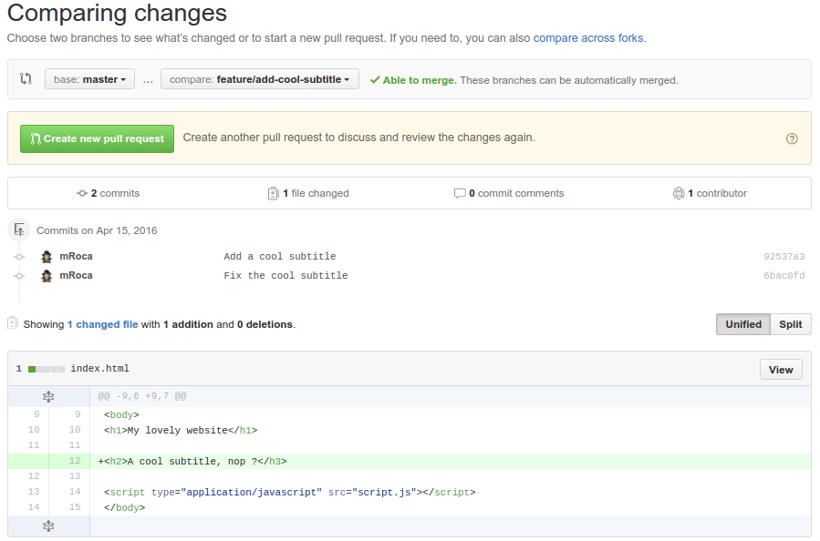
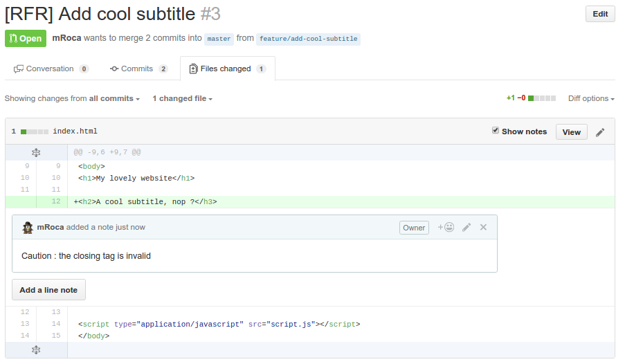
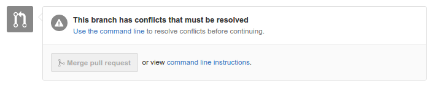
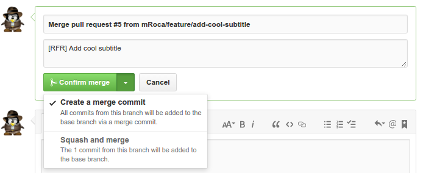

# Rapid Team Formation Method - Git

---

## Once upon a time ... a web project

```
.
├── index.html
├── script.js
└── style.css

0 directories, 3 files
```

And its git commits

```
* faace49 - Add comment line 4 (origin/master)
* d968810 - Add comment line 3
* dfd7dcd - Add comment line 2
* a671eb0 - Add comment line 1
* 4b19495 - Add index page
```

---

## What is the commit hash ?

```bash
git cat-file commit faace497d0644e1c0f5f08e7f9753b19f4227172
```

```
tree 5e1bb24d501fc601cf429c9d963d0cdcf709521a
parent d968810e0e2b3e1a77af1ffb53bcaf14457bdc64
author mRoca <mroca.dh@gmail.com> 1460712656 +0200
committer mRoca <mroca.dh@gmail.com> 1460712656 +0200

Add comment line 4
```

The commit hash function :

```
sha1(
    commit message  => "Add comment line 4"
    commiter        => Michel Roca <mroca.dh@gmail.com>
    commit date     => Fri Apr 15 11:30:56 2016 +0200
    author          => Michel Roca <mroca.dh@gmail.com>
    author date     => Fri Apr 15 11:30:56 2016 +0200
    tree            => 5e1bb24d501fc601cf429c9d963d0cdcf709521a
    parents         => [d968810e0e2b3e1a77af1ffb53bcaf14457bdc64]
)
```

---

## A new feature must be developed

**Create a new branch**

```bash
git checkout -b feature/add-cool-subtitle master
```

**Code**

```
 <h1>My lovely website</h1>

+<h2>A cool subtitle</h3>
+
 <script type="application/javascript" src="script.js"></script>
```

**Commit**

```bash
git commit -am "Add a cool subtitle"
```

```
* 92537a3 - Add a cool subtitle (feature/add-cool-subtitle)
* faace49 - Add comment line 4 (origin/master)
* d968810 - Add comment line 3
* dfd7dcd - Add comment line 2
* a671eb0 - Add comment line 1
* 4b19495 - Add index page
```

---

## ... And we add more and more code

**Fix things, add things, code things**

```
 <h1>My lovely website</h1>

-<h2>A cool subtitle</h3>
+<h2>A cool subtitle, nop ?</h3>

 <script type="application/javascript" src="script.js"></script>
```

**Commit & Push**

```bash
git commit -am "Fix the cool subtitle"
git push -u origin feature/add-cool-subtitle
```

```
* 6bac0fd - Fix the cool subtitle (origin/feature/add-cool-subtitle)
* 92537a3 - Add a cool subtitle
* faace49 - Add comment line 4 (origin/master)
* d968810 - Add comment line 3
* dfd7dcd - Add comment line 2
* a671eb0 - Add comment line 1
* 4b19495 - Add index page
```

---

## The branch is ok, we create the PR



---

## The PR is here !

```
[RFR] Add cool subtitle
```

* [RFR] = Ready for review
* [WIP] = Work in progress

**Cool : it's [RFR], the reviewers can now approve the PR with a `+1`**

> We can use tags or colors instead of prefixes

---

## ... but the PR is not ok : a reviewer writes some comments



---

## The developper fixes the PR

**Fix things, add things, code things**

```
-<h2>A cool subtitle</h3>
+<h2>A cool subtitle, nop ?</h2>
```

**Commit & Push**

```bash
git commit -am "Fix the title"
git push
```

```
* b4f62fe - Fix the title (origin/feature/add-cool-subtitle)
* 6bac0fd - Fix the cool subtitle
* 92537a3 - Add a cool subtitle
* faace49 - Add comment line 4 (origin/master)
* d968810 - Add comment line 3
* dfd7dcd - Add comment line 2
* a671eb0 - Add comment line 1
* 4b19495 - Add index page
```

> Tips : the `git commit --amend` command adds the current changes in the previous commit

---

## The PR is now ok

The reviewer adds a +1 comment in the PR page, the developer can now merge his PR !

*But...*

---

## Other commits have been merged by other developers into master



```
* eaa707b - Add the boss word (origin/feature/add-boss-word)
| * b4f62fe - Fix the title (origin/feature/add-cool-subtitle)
| * 6bac0fd - Fix the cool subtitle
| * 92537a3 - Add a cool subtitle
|/
* faace49 - Add comment line 4 (origin/master)
* d968810 - Add comment line 3
* dfd7dcd - Add comment line 2
* a671eb0 - Add comment line 1
* 4b19495 - Add index page
```

---

## Conflicts resolving - Option 1 : Merge

```bash
git merge master
```

```
<<<<<<< HEAD
<h2>A cool subtitle, nop ?</h2>
=======
<p>I love you ! <em>The boss.</em></p>
>>>>>>> master
```

```bash
git commit -a
```

```
Merge branch 'master' into feature/add-cool-subtitle

Conflicts:
        index.html
```

```bash
git push
```

---

## Conflicts resolving - Option 1 : Merge

The branches states after merge :

```
*   5516331 - Merge branch 'master' into feature/add-cool-subtitle (origin/feature/add-cool-subtitle)
|\
| *   44d94c9 - Merge PR #4 from feature/add-boss-word (origin/master)
| |\
| | * eaa707b - Add the boss word
| |/
* | b4f62fe - Fix the title
* | 6bac0fd - Fix the cool subtitle
* | 92537a3 - Add a cool subtitle
|/
* faace49 - Add comment line 4
* d968810 - Add comment line 3
* dfd7dcd - Add comment line 2
* a671eb0 - Add comment line 1
* 4b19495 - Add index page
```

---

## Conflicts resolving - Option 1 : Merge

If the PR is now merged, another merge commit will be created :

```
*   829218c - Merge PR #3 from feature/add-cool-subtitle (origin/master)
|\
| *   5516331 - Merge branch 'master' into feature/add-cool-subtitle
| |\
| |/
|/|
* |   44d94c9 - Merge PR #4 from feature/add-boss-word
|\ \
| * | eaa707b - Add the boss word
|/ /
| * b4f62fe - Fix the title
| * 6bac0fd - Fix the cool subtitle
| * 92537a3 - Add a cool subtitle
|/
* faace49 - Add comment line 4
* d968810 - Add comment line 3
* dfd7dcd - Add comment line 2
* a671eb0 - Add comment line 1
* 4b19495 - Add index page
```

* Problem 1 : There are useless commits
* Problem 2 : The project history is ugly and not useful

---

## Conflicts resolving - Option 2 : Rebase

The `git rebase` command allows to rewrite the branch history.

```bash
git rebase master
```

Conflict with `Add a cool subtitle` :

```
<<<<<<< HEAD
<p>I love you ! <em>The boss.</em></p>
=======
<h2>A cool subtitle</h3>
>>>>>>> Add a cool subtitle
```

```bash
git rebase --continue
```

... The `rebase`will apply diff merge on **EACH** commit of the target branch to rewrite history


```bash
git push -f
```

---

## Conflicts resolving - Option 2 : Rebase

Before :

```
*   44d94c9 - Merge PR #4 from feature/add-boss-word (origin/master)
|\
| * eaa707b - Add the boss word
|/
| * b4f62fe - Fix the title (origin/feature/add-cool-subtitle)
| * 6bac0fd - Fix the cool subtitle
| * 92537a3 - Add a cool subtitle
|/
* faace49 - Add comment line 4
...
```

After :

```
* 5d634d1 - Fix the title (origin/feature/add-cool-subtitle)
* 139770d - Fix the cool subtitle
* 4650798 - Add a cool subtitle
*   44d94c9 - Merge PR #4 from feature/add-boss-word (origin/master)
|\
| * eaa707b - Add the boss word
|/
* faace49 - Add comment line 4
...
```

---

## Git rebase

Before :

```
* * * * * * (master)
     *
      * * * (feature)
```

After :

```
* * * * * * (master)
           *
            * * * (feature)
```

---

## What about our commits ?

The feature branch contains 3 commits for 1 updated line. This is not cool.

The solution : we can "squash" the 3 commits onto 1 new commit !

---

## Git squash

```bash
git rebase -i HEAD~3
```

```
pick 4650798 Add a cool subtitle
pick 139770d Fix the cool subtitle
pick 5d634d1 Fix the title

# Rebase 44d94c9..5d634d1 onto 44d94c9
#
# Commands:
#  p, pick = use commit
#  r, reword = use commit, but edit the commit message
#  e, edit = use commit, but stop for amending
#  s, squash = use commit, but meld into previous commit
#  f, fixup = like "squash", but discard this commit's log message
#  x, exec = run command (the rest of the line) using shell
```

```
pick 4650798 Add a cool subtitle
squash 139770d Fix the cool subtitle
s 5d634d1 Fix the title
```

---

## Git squash

After saving :

```
# This is a combination of 3 commits.
# The first commit's message is:
Add a cool subtitle

# This is the 2nd commit message:

Fix the cool subtitle

# This is the 3rd commit message:

Fix the title
```

```
# This is a combination of 3 commits.
# The first commit's message is:
Add a cool subtitle

# This is the 2nd commit message:
# This is the 3rd commit message:

```

```
[HEAD detached 65da5a8] Add a cool subtitle
 1 file changed, 2 insertions(+)
Successfully rebased and updated refs/heads/feature/add-cool-subtitle.
```

---

## Git squash

```bash
git push -f
```

```
* 65da5a8 - Add a cool subtitle (origin/feature/add-cool-subtitle)
*   44d94c9 - Merge PR #4 from feature/add-boss-word (origin/master)
|\
| * eaa707b - Add the boss word
|/
* faace49 - Add comment line 4
* d968810 - Add comment line 3
* dfd7dcd - Add comment line 2
* a671eb0 - Add comment line 1
* 4b19495 - Add index page
```

---

## The PR is now approved and mergeable


---

## The PR is now approved and mergeable



---

## The PR is now approved and mergeable


---

## The result : an atomic and unique commit, a clean history

```
*   0e3382f - Merge PR #5 from feature/add-cool-subtitle (origin/master)
|\
| * 65da5a8 - Add a cool subtitle
|/
*   44d94c9 - Merge PR #4 from feature/add-boss-word
|\
| * eaa707b - Add the boss word
|/
* faace49 - Add comment line 4
* d968810 - Add comment line 3
* dfd7dcd - Add comment line 2
* a671eb0 - Add comment line 1
* 4b19495 - Add index page
```

---

## Development workflow

* `git checkout -b feature/my-new-feature master`
* Code....
* `git commit`
* `git commit`
* ...
* `git rebase master`
* `git push -u origin feature/my-new-feature`
* PR creation
* Review...
* Code & fixes...
* `git commit --amend && git push -f`
* Review... +1 !
* Merge PR
* GOTO begin ;-)

---

## Development workflow


https://www.atlassian.com/pt/git/workflows#!workflow-gitflow

---

## Naming convention

| Item                  | Name                          |
| --------------------- | ----------------------------- |
| Release branch        | release/v2.0.1                |
| Feature branch        | feature/my_feature_name       |
| Feature branch        | feature/2234_my_feature_name  |
| Hotfix branch         | hotfix/my_hotfix_name         |
| Commit                | Add my news                   |
| Tag                   | v2.0.1                        |
| Hotfix Tag            | v2.0.1.1                      |
| Work in progress PR   | [WIP] #1234 My pull request   |
| Ready for review PR   | [RFR] #1234 My pull request   |

​> When applied, this commit will: {{ Your commit message }}
---

## Cheat Sheet

https://gist.github.com/mRoca/ecbe2b82d94c7ef440f8

## Advanced git

http://csarrazi-slides.github.io/git-for-teams/#/

---

## Credits

* Git workflow image : https://www.atlassian.com/pt/git/workflows#!workflow-gitflow
